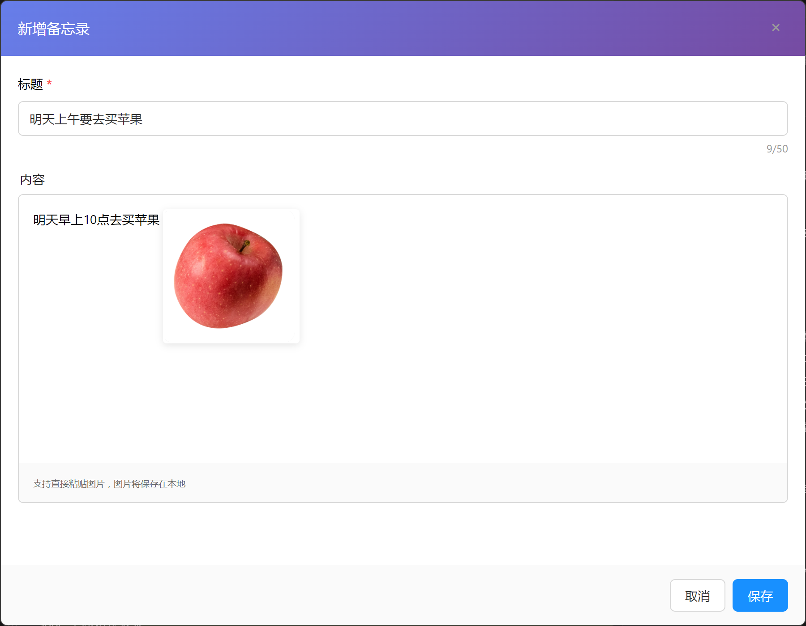

# 🎯 四象限 TODO 管理应用

<div align="center">


**基于艾森豪威尔矩阵的智能任务管理桌面应用**

[下载应用](#-下载安装) • [功能特色](#-功能特色) • [使用指南](#-使用指南) • [技术架构](#-技术架构)

</div>

---

## 📖 项目简介

四象限 TODO 是一款基于艾森豪威尔矩阵理论开发的桌面任务管理应用，帮助用户通过科学的四象限分类方法，高效管理日常任务，提升工作效率。

### 🎯 核心理念

将任务按照**重要性**和**紧急性**分为四个象限：

-   🔥 **重要且紧急** - 需要立即处理的重要任务
-   📚 **重要不紧急** - 重要但不紧急的任务（如学习、规划）
-   ⚡ **紧急不重要** - 紧急但不重要的任务（如干扰性工作）
-   🗑️ **不重要不紧急** - 既不重要也不紧急的任务

## ✨ 功能特色

### 🎨 直观的四象限布局

-   **视觉化任务分类**：一眼就能看出任务的优先级
-   **智能颜色编码**：不同象限使用不同颜色，便于快速识别
-   **响应式设计**：适配不同屏幕尺寸

### 🖱️ 强大的拖拽功能

-   **同象限排序**：在同一个象限内拖拽调整任务优先级
-   **跨象限移动**：轻松将任务从一个象限移动到另一个象限
-   **流畅的交互体验**：支持触摸和鼠标操作

### 📝 富文本编辑器

-   **支持图片粘贴**：直接 Ctrl+V 粘贴图片，自动保存到本地
-   **图片预览和编辑**：双击图片全屏预览，支持缩放、拖拽、旋转
-   **图片复制功能**：右键图片可复制到剪贴板
-   **智能图片管理**：图片自动保存为本地文件，便于管理

### ⏰ 智能时间管理

-   **自动时间记录**：记录每个任务的创建时间和完成时间
-   **历史任务管理**：已完成任务超过 24 小时后自动隐藏
-   **时间格式化显示**：智能显示"2 小时前"、"昨天"等相对时间

### 💾 完善的数据管理

-   **数据导入导出**：支持压缩包格式的完整数据备份
-   **图片文件管理**：图片保存为本地文件，便于迁移
-   **数据统计**：实时显示各象限任务数量统计
-   **自动清理**：定期清理未使用的图片文件

### 🪟 灵活的窗口模式

-   **桌面小组件模式**：适合作为桌面便签使用
-   **普通窗口模式**：标准应用窗口
-   **窗口折叠**：可折叠为标题栏节省空间
-   **固定到桌面**：小组件模式下可固定显示

### 🎨 主题切换

-   **深色/浅色主题**：根据个人喜好和使用环境切换
-   **护眼设计**：减少长时间使用的视觉疲劳

## 🖼️ 应用截图

<div align="center">

### 主界面 - 四象限任务管理


_直观的四象限布局，支持拖拽排序和跨象限移动_


_直观的四象限布局，支持拖拽排序和跨象限移动_

### 富文本编辑界面



_支持图片粘贴、预览和编辑的富文本编辑器_

### 图片预览功能


_双击图片全屏预览，支持缩放、拖拽、旋转_

### 数据管理界面


_支持数据导入导出和统计信息_

### 主题切换效果


_深色/浅色主题无缝切换_

</div>

## 🚀 下载安装

> 📦 **最新版本**: [v1.0.0](https://github.com/CalmHarbin/quadrant-todo/releases/latest)

### Windows

-   [下载安装包](https://github.com/CalmHarbin/quadrant-todo/releases/latest/download/四象限TODO-Setup-1.0.0.exe)
-   [便携版](https://github.com/CalmHarbin/quadrant-todo/releases/latest/download/四象限TODO-1.0.0-win.zip)

### macOS

-   [Intel芯片](https://github.com/CalmHarbin/quadrant-todo/releases/latest/download/四象限TODO-1.0.0-x64.dmg)
-   [Apple芯片](https://github.com/CalmHarbin/quadrant-todo/releases/latest/download/四象限TODO-1.0.0-arm64.dmg)

### Linux

-   [AppImage](https://github.com/CalmHarbin/quadrant-todo/releases/latest/download/四象限TODO-1.0.0-x86_64.AppImage)

### 📋 安装说明

1. **Windows**: 下载`.exe`安装包，双击运行安装程序
2. **macOS**: 下载对应芯片版本的`.dmg`文件，拖拽到Applications文件夹
3. **Linux**: 下载`.AppImage`文件，添加执行权限后运行

## 🛠️ 技术架构

### 技术栈

-   **前端框架**：Vue 3 + TypeScript
-   **UI 组件库**：Naive UI
-   **桌面框架**：Electron
-   **构建工具**：Vite
-   **数据存储**：文件系统（Electron 环境）/ localStorage（Web 环境）

### 项目结构

```
四象Todo/
├── src/
│   ├── App.vue           # 主应用组件
│   ├── main.ts           # Vue应用入口
│   ├── components/       # 组件目录
│   │   ├── CrossQuadrantDraggable.vue
│   │   ├── DraggableMemoList.vue
│   │   └── modals/       # 模态框组件
│   ├── types/            # 类型定义
│   ├── utils/            # 工具函数
│   └── styles/           # 样式文件
├── electron/
│   ├── main.ts           # Electron主进程
│   └── preload.ts        # 预加载脚本
├── dist/                 # 构建输出
└── release/              # 打包输出
```

## 📖 使用指南

### 基本操作

1. **添加任务**：点击象限右上角"+"按钮
2. **编辑任务**：双击任务卡片
3. **移动任务**：拖拽任务到不同象限
4. **标记完成**：点击任务前的勾选框
5. **删除任务**：点击任务右上角"×"按钮

### 高级功能

-   **富文本编辑**：在编辑框中输入文字或粘贴图片
-   **图片处理**：双击图片全屏预览，右键复制图片
-   **查看历史**：点击 📋 按钮查看已完成的任务
-   **数据备份**：点击 📁 按钮导出压缩包
-   **主题切换**：点击 🌙/☀️ 按钮切换主题

## 🔧 开发环境

### 环境要求

-   Node.js >= 16.0.0
-   npm >= 8.0.0

### 安装依赖

```bash
npm install
```

### 开发模式

```bash
npm run electron:dev
```

### 构建应用

```bash
# Windows
npm run build:win

# macOS
npm run build:mac

# Linux
npm run build:linux
```

## 📊 数据结构

```typescript
interface Memo {
    id?: number
    title: string
    content: string // 支持HTML富文本
    quadrant: string // 象限类型
    created?: number // 创建时间
    completed?: boolean // 完成状态
    completedTime?: number // 完成时间
    sortOrder?: number // 排序顺序
}
```

## 🤝 贡献指南

我们欢迎所有形式的贡献！

### 如何贡献

1. Fork 本仓库
2. 创建你的特性分支 (`git checkout -b feature/AmazingFeature`)
3. 提交你的修改 (`git commit -m 'Add some AmazingFeature'`)
4. 推送到分支 (`git push origin feature/AmazingFeature`)
5. 打开一个 Pull Request

### 报告问题

如果你发现了 bug 或有功能建议，请通过 [Issues](https://github.com/your-username/quadrant-todo/issues) 告诉我们。

## 📝 更新日志

### v1.0.0 (2024-01-XX)

-   ✅ 实现完整的四象限任务管理功能
-   ✅ 支持拖拽排序和跨象限移动
-   ✅ 集成富文本编辑器和图片管理
-   ✅ 添加时间记录和历史管理功能
-   ✅ 支持数据导入导出
-   ✅ 实现主题切换和窗口模式切换

## 📄 许可证

本项目基于 [MIT License](LICENSE) 开源协议。

## 🙏 致谢

-   [Vue.js](https://vuejs.org/) - 渐进式 JavaScript 框架
-   [Electron](https://www.electronjs.org/) - 跨平台桌面应用框架
-   [Naive UI](https://www.naiveui.com/) - Vue 3 组件库
-   [Vite](https://vitejs.dev/) - 下一代前端构建工具

## 📞 联系我们

-   **项目主页**：[https://github.com/your-username/quadrant-todo](https://github.com/your-username/quadrant-todo)
-   **问题反馈**：[Issues](https://github.com/your-username/quadrant-todo/issues)
-   **邮箱**：363639121@qq.com

---

<div align="center">

**如果这个项目对你有帮助，请给它一个 ⭐️**

Made with ❤️ by [Your Name](https://github.com/your-username)

</div>
